<div align="center">


**Building Open-Ended Embodied Agents with Internet-Scale Knowledge**

[[Website]](https://minedojo.org)
[[Arxiv Paper]](https://arxiv.org/abs/2206.08853)
[[PDF]](https://arxiv.org/pdf/2206.08853.pdf)
[[Docs]](https://docs.minedojo.org)
[[Open Database]](https://minedojo.org/knowledge_base)
[[MineCLIP]](https://github.com/MineDojo/MineCLIP)
[[Team]](https://minedojo.org/index.html#team)

[](https://pypi.org/project/MineDojo/)
[](https://pypi.org/project/minedojo/)
[](https://pepy.tech/project/MineDojo)
[](http://docs.minedojo.org/index.html "Docs")
[](https://github.com/MineDojo/MineDojo/blob/main/LICENSE)
______________________________________________________________________

</div>

 is a new AI research framework for building open-ended, generally capable embodied agents. 
MineDojo features a **massive simulation suite** built on Minecraft with 1000s of diverse tasks, and provides **open access to an internet-scale knowledge base** of 730K YouTube videos, 7K Wiki pages, 340K Reddit posts. 

Using MineDojo, AI agents can freely explore a procedurally generated 3D world with diverse terrains to roam :earth_asia:	, materials to mine :gem:, tools to craft :wrench:, structures to build :european_castle:, and wonders to discover :sparkles:. Instead of training in isolation, your agent will be able to learn from the collective wisdom of millions of human players around the world! 

:partying_face: **NEWS**: 

* MineDojo won the [Outstanding Paper award](https://blog.neurips.cc/2022/11/21/announcing-the-neurips-2022-awards/) at NeurIPS!
* MineCLIP reward model and agent code are [released](https://github.com/MineDojo/MineCLIP)! 
* We have open-sourced the [creative task labeling UI](https://github.com/MineDojo/TaskCreationUI), so researchers can curate more tasks from YouTube themselves. This tool can also be used beyond Minecraft for other agent domains.


# Contents

- [Installation](#Installation)
- [Getting Started](#Getting-Started)
- [Benchmarking Suite](#Benchmarking-Suite)
  - [Programmatic Tasks](#Programmatic-Tasks)
  - [Creative Tasks](#Creative-Tasks)
  - [Playthrough Task](#Playthrough-task)
- [Our Paper](#Check-Out-Our-Paper)
- [License](#License)

# Installation

MineDojo requires Python ≥ 3.9. We have tested on Ubuntu 20.04 and Mac OS X. **Please follow [this guide](https://docs.minedojo.org/sections/getting_started/install.html#prerequisites)** to install the prerequisites first, such as JDK 8 for running Minecraft backend. We highly recommend creating a new [Conda virtual env](https://docs.conda.io/projects/conda/en/latest/user-guide/concepts/environments.html) to isolate dependencies. Alternatively, we have provided a [pre-built Docker image](https://docs.minedojo.org/sections/getting_started/install.html#docker-image) for easier installation.

Installing the MineDojo stable version is as simple as:

```bash
pip install minedojo
```

To install the cutting edge version from the main branch of this repo, run:

```bash
git clone https://github.com/MineDojo/MineDojo && cd MineDojo
pip install -e .
```


You can run the script below to verify the installation. It takes a while to compile the Java code for the first time. After that you should see a Minecraft window pop up, with the same gaming interface that human players receive. You should see the message `[INFO] Installation Success` if everything goes well.

```bash
python minedojo/scripts/validate_install.py
```

Note that if you are on a headless machine, don't forget to prepend either `xvfb-run` or `MINEDOJO_HEADLESS=1`:

```bash
xvfb-run python minedojo/scripts/validate_install.py
# --- OR ---
MINEDOJO_HEADLESS=1 python minedojo/scripts/validate_install.py
```


# Getting Started

MineDojo provides a [Gym-style](https://www.gymlibrary.dev/) interface for developing embodied agents that interact with the simulator in a loop.  Here is a very simple code snippet of a hardcoded agent that runs forward and jumps every 10 steps in the "Harvest Wool" task: 

```python
import minedojo

env = minedojo.make(
    task_id="harvest_wool_with_shears_and_sheep",
    image_size=(160, 256)
)
obs = env.reset()
for i in range(50):
    act = env.action_space.no_op()
    act[0] = 1    # forward/backward
    if i % 10 == 0:
        act[2] = 1    # jump
    obs, reward, done, info = env.step(act)
env.close()
```

Please refer to [this tutorial](https://docs.minedojo.org/sections/getting_started/sim.html) for a detailed walkthrough of your first agent. MineDojo features a multimodal observation space (RGB, compass, voxels, etc.) and a compound action space (movement, camera, attack, craft, etc.). See [this doc](http://docs.minedojo.org/sections/getting_started/sim.html#basic-observation-and-action-spaces) to learn more. We recommend you to reference the full [observation](http://docs.minedojo.org/sections/core_api/obs_space.html) and [action space](http://docs.minedojo.org/sections/core_api/action_space.html) specifications.

MineDojo can be extensively customized to be tailored to your research needs. Please check out customization guides on [tasks](https://docs.minedojo.org/sections/customization/task.html), [simulation](https://docs.minedojo.org/sections/customization/sim.html), and [privileged observation](https://docs.minedojo.org/sections/customization/privileged_obs.html).

MineCLIP reward model and agent code are [open-sourced](https://github.com/MineDojo/MineCLIP). Please refer to the [paper](https://arxiv.org/abs/2206.08853) for more algorithmic details.


# Benchmarking Suite

MineDojo features a massively multitask benchmark with **3142 tasks** in the current release. 
We design a unified top-level function `minedojo.make()`, similar to [`gym.make`](https://www.gymlibrary.ml/content/api/), that creates all the tasks and environments in our benchmarking suite. We categorize the tasks into **Programmatic**, **Creative**, and **Playthrough**.


| Task Category | Count | Description                                                        |
|---------------|-------|--------------------------------------------------------------------|
| **Programmatic**  | 1581  | Can be automatically scored based on ground-truth simulator states |
| **Creative**      | 1560  | Do not have well-defined or easily-automated success criteria      |
| **Playthrough**   | 1     | Special achievement: defeat the Ender dragon, "beat the game"   |

We pair all tasks with natural language descriptions of task goals (i.e. "prompts"), such as `"obtain 8 bone in swampland"` and `"make a football stadium"`. Many tasks also have step-by-step guidance generated by GPT-3. Users can access a comprehensive listing of prompts and guidance for all task by:
```python
# list of string IDs
all_ids = minedojo.tasks.ALL_TASK_IDS
# dict: {task_id: (prompt, guidance)}
all_instructions = minedojo.tasks.ALL_TASK_INSTRUCTIONS
```

## Programmatic Tasks

1581 Programmatic tasks can be further divided into four categories: (1) **Survival**: surviving for a designated number of days, (2) **Harvest**: finding, obtaining, cultivating, or manufacturing hundreds of materials and objects, (3) **Tech Tree**: the skills of crafting and using a hierarchy of tools, and (4) **Combat**:  fight various monsters and creatures to test agent's reflex and martial skills. Refer to [this doc](https://docs.minedojo.org/sections/core_api/sim.html#programmatic-tasks) for more information.

The following code creates a Programmatic task with ID `harvest_milk` with 160x256 resolution:
```python
env = minedojo.make(task_id="harvest_milk", image_size=(160, 256))
```

You can access task-related attributes such as `task_prompt` and `task_guidance`:
```bash
>>> env.task_prompt
obtain milk from a cow
>>> env.task_guidance
1. Find a cow.
2. Right-click the cow with an empty bucket.
```
Here we show a few examples from each category:

| Task Prompt | Visualization | Task Prompt | Visualization |
|---|---|---|---|
| shear a sheep with shears and a sheep nearby | 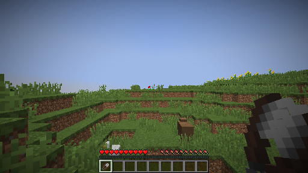 | obtain milk from a cows in forest with an empty bucket | 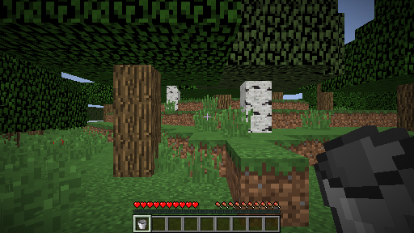 |
| obtain 8 ghast tear | 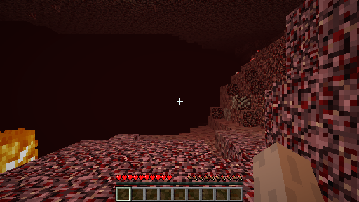 | obtain chicken in swampland | 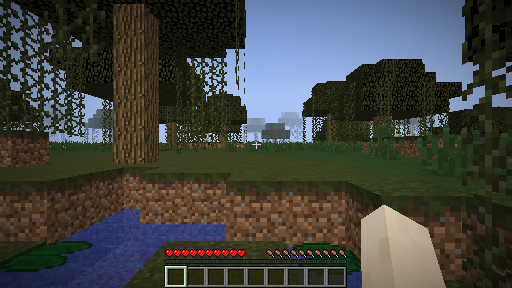 |
| combat a husk in night desert with a diamond sword, shield, and a full suite of iron armors | 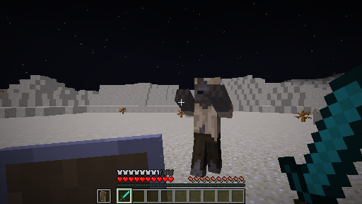 | hunt a bat in night plains with a iron sword, shield, and a full suite of diamond armors | 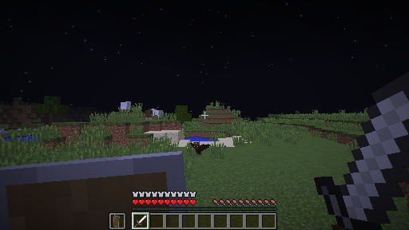 |
| combat a spider in night forest with a wooden sword, shield, and a full suite of iron armors | 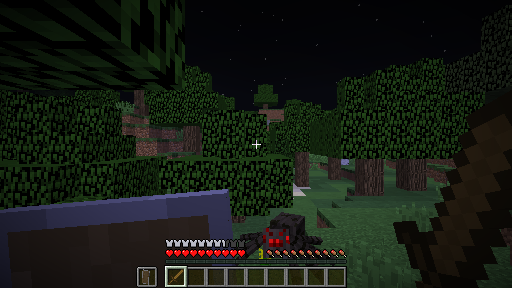 | hunt a pig in extreme hills with a wooden sword, shield, and a full suite of leather armors | 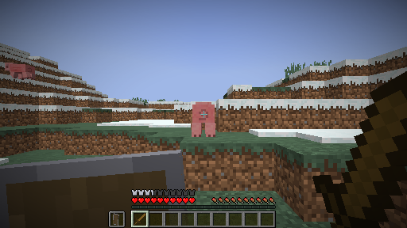 |
| starting from wood tools, craft and use a diamond sword | 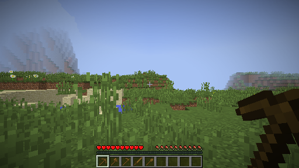 | starting from stone tools, craft and use a tnt | 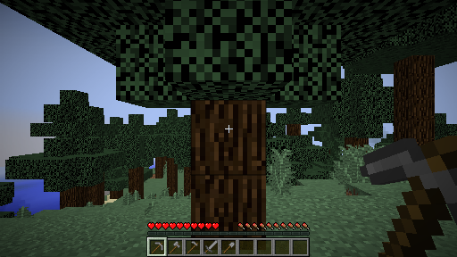 |
| starting from gold tools, craft and use a clock | 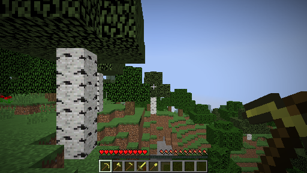 | starting from diamond tools, craft and use a dispenser | 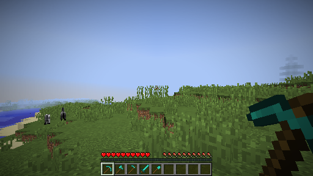 |
| survive as long as possible | 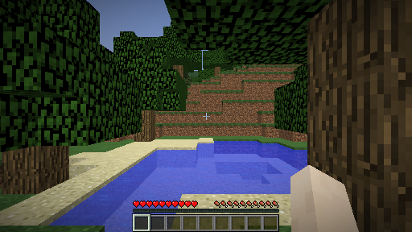 | survive as long as possible given a sword and some food | 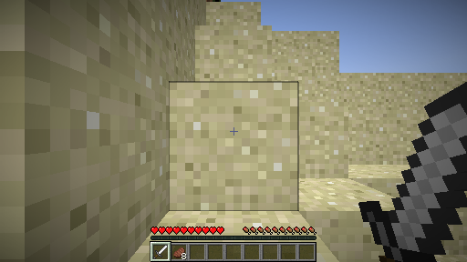 |

## Creative Tasks

Similar to Programmatic tasks, Creative tasks can be instantiated by `minedojo.make()`. The only difference is that `task_id` no longer has any semantic meaning. Instead, the format becomes `creative:{task_index}`. You can query all Creative task IDs from `minedojo.tasks.ALL_CREATIVE_TASK_IDS`.

The following code instantiates the 256th task from our Creative suite:
```python
env = minedojo.make(task_id="creative:255", image_size=(160, 256))
```

Let's see what the task prompt and guidance are:
```bash
>>> env.task_prompt
Build a replica of the Great Pyramid of Giza
>>> env.task_guidance
1. Find a desert biome.
2. Find a spot that is 64 blocks wide and 64 blocks long.
3. Make a foundation that is 4 blocks high.
4. Make the first layer of the pyramid using blocks that are 4 blocks wide and 4 blocks long.
5. Make the second layer of the pyramid using blocks that are 3 blocks wide and 3 blocks long.
6. Make the third layer of the pyramid using blocks that are 2 blocks wide and 2 blocks long.
7. Make the fourth layer of the pyramid using blocks that are 1 block wide and 1 block long.
8. Make the capstone of the pyramid using a block that is 1 block wide and 1 block long.
```
Please refer to [this doc](https://docs.minedojo.org/sections/core_api/sim.html#creative-tasks) for more details on Creative tasks.

## Playthrough Task

Playthrough task's instruction is to "Defeat the Ender Dragon and obtain the trophy dragon egg". This task holds a unique position because killing the dragon means "beating the game" in the traditional sense of the phrase, and is considered the most significant achievement for a new player. The mission requires lots of preparation, exploration, agility, and trial-and-error, which makes it a grand challenge for AI:


```python
env = minedojo.make(task_id="playthrough",image_size=(160, 256))
```

# Using the Knowledge Base

Minecraft has more than 100M active players, who have collectively generated an enormous wealth of data. **MineDojo features a massive database collected automatically from the internet.** AI agents can learn from this treasure trove of knowledge to harvest actionable insights, acquire diverse skills, develop complex strategies, and discover interesting objectives to pursue. All our databases are **open-access and available to download today**!


## YouTube Database 
<p style="margin-top: -16px"><a href="https://colab.research.google.com/drive/1zZbRVfpyl7zteb74PRVeEbozj7hbbixi#scrollTo=97llf1-ybOyX">  </a> <a href="https://doi.org/10.5281/zenodo.6641142" style="border-bottom: none" target="_blank"></a></p>

Minecraft is among the most streamed games on YouTube. Human players have demonstrated a stunning range of creative activities and sophisticated missions that take hours to complete. **We collect 730K+ narrated Minecraft videos, which add up to ~300K hours and 2.2B words in English transcripts.** The time-aligned transcripts enable the agent to ground free-form natural language in video pixels and learn the semantics of diverse activities without laborious human labeling. Please refer to the [doc page](https://docs.minedojo.org/sections/getting_started/data.html#youtube-database) for how to load our YouTube database.

## Wiki Database
<p style="margin-top: -16px"><a href="https://colab.research.google.com/drive/1zZbRVfpyl7zteb74PRVeEbozj7hbbixi#scrollTo=zUIQWbN-dbX9">  </a> <a href="https://doi.org/10.5281/zenodo.6640448" style="border-bottom: none" target="_blank"></a></p>

The Wiki pages cover almost every aspect of the game mechanics, and supply a rich source of unstructured knowledge in multimodal tables, recipes, illustrations, and step-by-step tutorials. **We scrape ~7K pages that interleave text, images, tables, and diagrams.** To preserve the layout information, we also save the screenshots of entire pages and extract bounding boxes of the visual elements. Please refer to the [doc page](https://docs.minedojo.org/sections/getting_started/data.html#wiki-database) for how to load our Wiki database.

## Reddit Database
<p style="margin-top: -16px"><a href="https://colab.research.google.com/drive/1zZbRVfpyl7zteb74PRVeEbozj7hbbixi#scrollTo=_zagI0pheWTN">  </a> <a href="https://doi.org/10.5281/zenodo.6641114" style="border-bottom: none" target="_blank"></a></p>

**We collect 340K+ Reddit posts along with 6.6M comments under the “r/Minecraft” subreddit.** These posts ask questions on how to solve certain tasks, showcase cool architectures and achievements in image/video snippets, and discuss general tips and tricks for players of all expertise levels. Large language models can be finetuned on our Reddit corpus to internalize Minecraft-specific concepts and develop sophisticated strategies. Please refer to the [doc page](https://docs.minedojo.org/sections/getting_started/data.html#reddit-database) for how to load our Reddit database.


# Check out our paper! 

Our paper is available on [Arxiv](https://arxiv.org/abs/2206.08853). If you find our code or databases useful, please consider citing us! 

```bibtex
@inproceedings{fan2022minedojo,
  title     = {MineDojo: Building Open-Ended Embodied Agents with Internet-Scale Knowledge},
  author    = {Linxi Fan and Guanzhi Wang and Yunfan Jiang and Ajay Mandlekar and Yuncong Yang and Haoyi Zhu and Andrew Tang and De-An Huang and Yuke Zhu and Anima Anandkumar},
  booktitle = {Thirty-sixth Conference on Neural Information Processing Systems Datasets and Benchmarks Track},
  year      = {2022},
  url       = {https://openreview.net/forum?id=rc8o_j8I8PX}
}
```

# License

| Component        | License                                                                                                                             |
|------------------|-------------------------------------------------------------------------------------------------------------------------------------|
| Codebase (this repo)         | [MIT License](LICENSE)                                                                                                                      |
| YouTube Database | [Creative Commons Attribution 4.0 International (CC BY 4.0)](https://creativecommons.org/licenses/by/4.0/legalcode)                 |
| Wiki Database    | [Creative Commons Attribution Non Commercial Share Alike 3.0 Unported](https://creativecommons.org/licenses/by-nc-sa/3.0/legalcode) |
| Reddit Database  | [Creative Commons Attribution 4.0 International (CC BY 4.0)](https://creativecommons.org/licenses/by/4.0/legalcode)                 |
